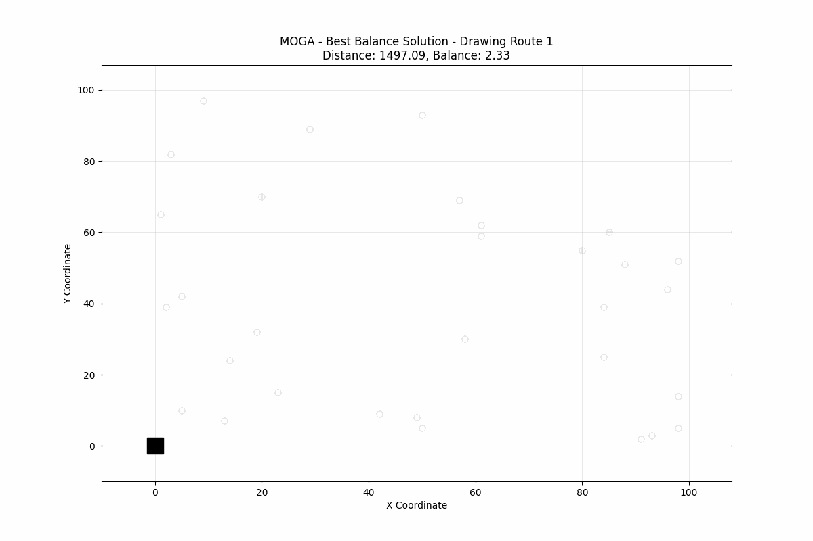

# Multi-Objective Vehicle Routing Problem (MOVRP) Project

This project implements and compares Multi-Objective Genetic Algorithms (MOGA) and NSGA-II for solving the Multi-Objective Capacitated Vehicle Routing Problem (CVRP).



## Quick Start

### Prerequisites

- Python 3.7 or higher
- pip (Python package installer)
- Jupyter Notebook

### Installation

1. **Clone or download this repository** to your local machine.

2. **Navigate to the project directory:**

   ```bash
   cd MID-TERM_P2
   ```

3. **Install required dependencies:**

   ```bash
   pip install -r requirements.txt
   ```

   The project requires the following packages:

   - `numpy` - Numerical computing
   - `scipy` - Scientific computing
   - `pandas` - Data manipulation
   - `matplotlib` - Plotting and visualization
   - `jupyter` - Jupyter notebook environment
   - `pyDOE` - Design of experiments

4. **Start Jupyter Notebook:**
   ```bash
   jupyter notebook
   ```

## Project Structure

```
MID-TERM_P2/
├── README.md                     # This file
├── requirements.txt              # Python dependencies
├── examplesCode/                 # Algorithm implementations
│   ├── moga.ipynb               # Multi-Objective Genetic Algorithm
│   └── nsga-2.ipynb             # NSGA-II implementation
├── project/
│   ├── data/                    # CVRP problem instances
│   │   ├── A-n32-k5.json       # Small instance (32 nodes, 5 vehicles)
│   │   ├── B-n78-k10.json      # Medium instance (78 nodes, 10 vehicles)
│   │   └── X-n101-k25.json     # Large instance (101 nodes, 25 vehicles)
│   ├── Images/                  # Generated visualizations
│   │   ├── moga_best_balance_routes.gif
│   │   ├── moga_best_distance_routes.gif
│   │   ├── nsga2_best_balance_routes.gif
│   │   └── nsga2_best_distance_routes.gif
│   └── notebooks/               # Experiment notebooks
│       ├── small.ipynb          # Small instance experiments
│       ├── mediumH.ipynb        # Medium instance experiments
│       └── largeC.ipynb         # Large instance experiments
└── Task/                        # Assignment documentation
    ├── Assignmet-2.pdf
    ├── assingment.txt
    └── CHECKLIST.md
```

## Running the Algorithms

### 1. Algorithm Implementations

Navigate to the `examplesCode/` directory and open the following notebooks:

- **`moga.ipynb`** - Multi-Objective Genetic Algorithm implementation
- **`nsga-2.ipynb`** - NSGA-II algorithm implementation

These notebooks contain the core algorithm implementations with detailed explanations.

### 2. Running Experiments

The `project/notebooks/` directory contains three experiment notebooks designed for different problem sizes:

- **`small.ipynb`** - Experiments on A-n32-k5 dataset (32 nodes, 5 vehicles)
- **`mediumH.ipynb`** - Experiments on B-n78-k10 dataset (78 nodes, 10 vehicles)
- **`largeC.ipynb`** - Experiments on X-n101-k25 dataset (101 nodes, 25 vehicles)

### 3. Data Format

The problem instances are stored in JSON format in `project/data/`. Each file contains:

- Node coordinates
- Demand values
- Vehicle capacity constraints
- Depot information

## Expected Outputs

The algorithms generate:

- **Pareto front visualizations** showing trade-offs between objectives
- **Route visualizations** displaying optimal vehicle routes
- **Convergence plots** showing algorithm performance over generations
- **Statistical comparisons** between MOGA and NSGA-II

## Objectives

The algorithms optimize two conflicting objectives:

1. **Minimize total distance** - Reduce transportation costs
2. **Balance workload** - Ensure equal distribution of work among vehicles

## Customization

You can modify algorithm parameters in the notebooks:

- Population size
- Number of generations
- Crossover and mutation rates
- Selection pressure
- Problem-specific constraints

## Performance Analysis

The project includes comprehensive performance analysis:

- Hypervolume indicator calculations
- Convergence rate comparisons
- Solution quality metrics
- Runtime performance analysis

## Contributing

When working with this project:

1. Ensure all dependencies are installed
2. Run notebooks in the recommended order (examples → experiments)
3. Check that all visualizations are generated correctly
4. Verify results are reproducible

## Notes

- All notebooks are designed to run independently
- Results may vary slightly due to the stochastic nature of genetic algorithms
- Generated images are automatically saved to `project/Images/`
- Consider computational time when running large instances

## Troubleshooting

**Common issues:**

- **Import errors:** Ensure all dependencies are installed with `pip install -r requirements.txt`
- **Memory issues:** Reduce population size or number of generations for large instances
- **Visualization problems:** Check matplotlib backend configuration
- **File not found:** Verify data files exist in `project/data/` directory
